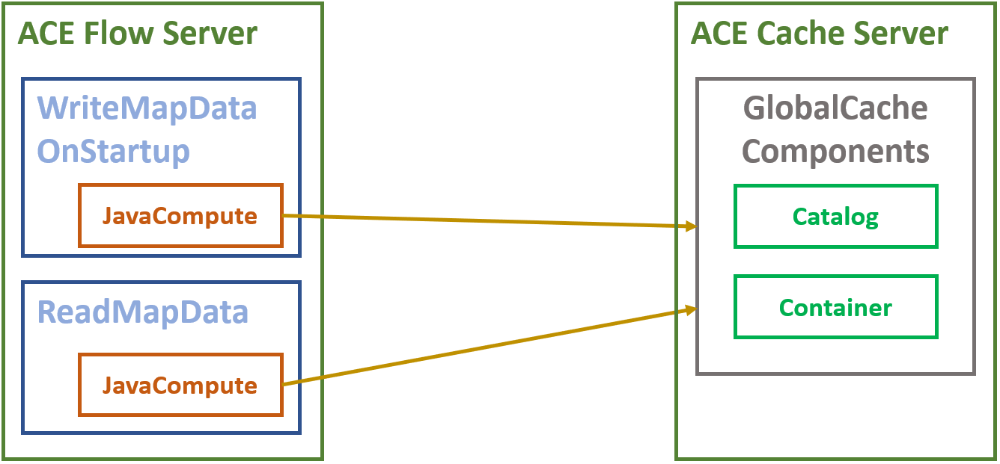
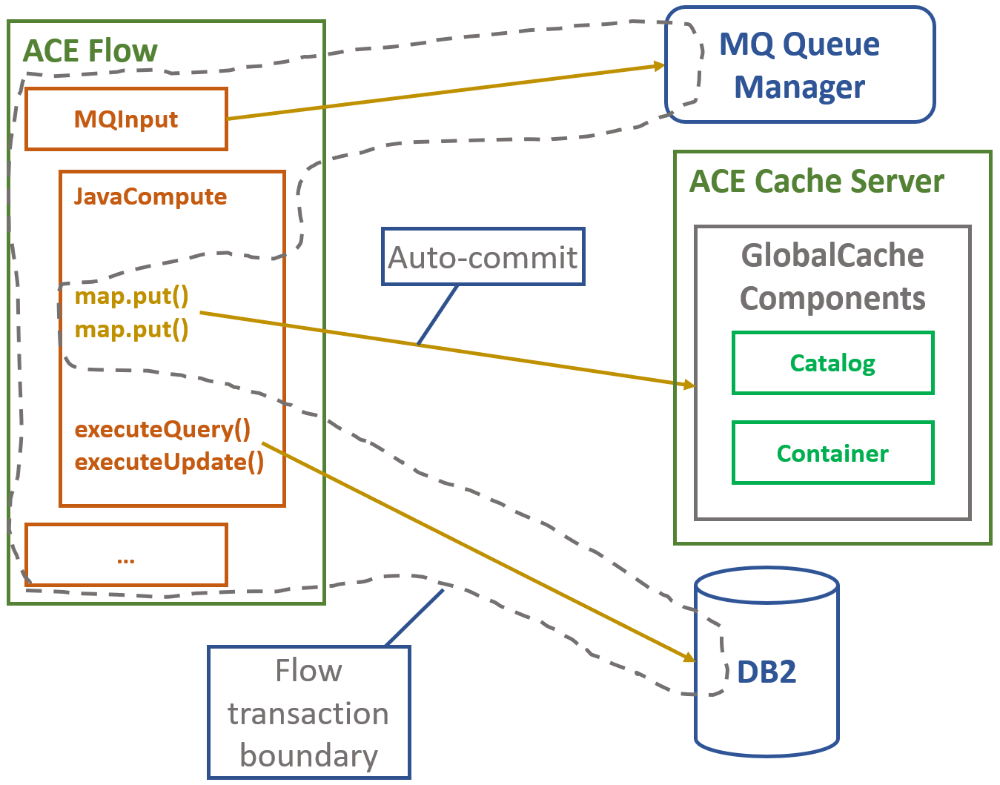

# ace-global-cache-example
Example using the embedded global cache in ACE

Uses two flows:
- WriteMapDataOnStartup populates the cache on first startup, and updates the version number of each entry on subequent startups.
- ReadMapData runs every five seconds and reads all of the entries written by WriteMapDataOnStartup ten times.

## Deployment configuration

The results below were obtained using two independent ACE servers, with one running the flows and the other dedicated to 
the global cache itself.



## Pessimistic locking (ACE default)

Running with an empty cache:
```
[lots of log spam on startup]
2022-08-25 18:46:40.338644: BIP1991I: Integration server has finished initialization. 
2022-08-25 18:46:42.590184: BIP7155I: The integration server has established a connection to the embedded global cache. 
WriteMapDataOnStartup setting 1000 entries
2022-08-25 18:46:42.787     40 ReadMapData reading entries (10 times 1000 entries)
2022-08-25 18:46:50.554     38 WriteMapDataOnStartup finished; numberOfEntriesCreated=1000 numberOfEntriesUpdated=0
2022-08-25 18:46:57.457     40 ReadMapData finished; foundAnyNullValues=true foundDifferentVersions=false
2022-08-25 18:46:57.459     40 ReadMapData looking for EXAMPLE.BASIC.MAP
2022-08-25 18:46:57.461     40 ReadMapData reading entries (10 times 1000 entries)
2022-08-25 18:47:05.370     40 ReadMapData finished; foundAnyNullValues=false foundDifferentVersions=false
2022-08-25 18:47:05.372     40 ReadMapData looking for EXAMPLE.BASIC.MAP
2022-08-25 18:47:05.374     40 ReadMapData reading entries (10 times 1000 entries)
2022-08-25 18:47:13.223     40 ReadMapData finished; foundAnyNullValues=false foundDifferentVersions=false
2022-08-25 18:47:13.225     40 ReadMapData looking for EXAMPLE.BASIC.MAP
2022-08-25 18:47:13.227     40 ReadMapData reading entries (10 times 1000 entries)
```
where 10000 reads take around 7500-7800ms

## Optimistic locking

server.conf.yaml snippet
```
---
ResourceManagers:
  GlobalCache:
    cacheOn: true
    catalogServiceEndPoints: '192.168.1.252:2800'
    catalogClusterEndPoints: 'ExampleCatalogServer1:192.168.1.252:2803:2801'
    objectGridCustomFile: '/home/newuser/tmp/gc/objectgrid.xml'
    deploymentPolicyCustomFile: '/home/newuser/tmp/gc/deployment.xml'
```

/home/newuser/tmp/gc/objectgrid.xml contains
```
<?xml version="1.0" encoding="UTF-8"?>
<objectGridConfig xmlns:xsi="http://www.w3.org/2001/XMLSchema-instance"
  xsi:schemaLocation="http://ibm.com/ws/objectgrid/config ../objectGrid.xsd"
  xmlns="http://ibm.com/ws/objectgrid/config">
 <objectGrids>
  <objectGrid name="WMB">
   <backingMap name="EXAMPLE.*" template="true" timeToLive="0" ttlEvictorType="LAST_UPDATE_TIME" lockStrategy="OPTIMISTIC_NO_VERSIONING" nearCacheInvalidationEnabled="true" copyMode="COPY_TO_BYTES"/>
   <backingMap name="SYSTEM.BROKER.*" template="true" timeToLive="0" ttlEvictorType="LAST_UPDATE_TIME" lockStrategy="PESSIMISTIC" copyMode="COPY_TO_BYTES"/>
  </objectGrid>
 </objectGrids>
</objectGridConfig>
```

/home/newuser/tmp/gc/deployment.xml contains
```
<?xml version="1.0" encoding="UTF-8"?>
<deploymentPolicy xmlns:xsi="http://www.w3.org/2001/XMLSchema-instance" 
  xsi:schemaLocation="http://ibm.com/ws/objectgrid/deploymentPolicy ../deploymentPolicy.xsd" 
  xmlns="http://ibm.com/ws/objectgrid/deploymentPolicy"> 
 <objectgridDeployment objectgridName="WMB">
  <mapSet name="mapSet" numberOfPartitions="13" minSyncReplicas="0" maxSyncReplicas="1" replicaReadEnabled="true" >
   <map ref="EXAMPLE.*"/>
   <map ref="SYSTEM.BROKER.*"/>
   <zoneMetadata>
    <shardMapping shard="P" zoneRuleRef="wmbRule"/>
    <shardMapping shard="S" zoneRuleRef="wmbRule"/>
    <zoneRule name="wmbRule" exclusivePlacement="false">
     <zone name="WMBZone" />
    </zoneRule>
   </zoneMetadata>
  </mapSet>
 </objectgridDeployment>
</deploymentPolicy>
```

Running with an empty cache:
```
[lots of log spam on startup]
2022-08-25 18:35:12.021191: BIP1991I: Integration server has finished initialization. 
2022-08-25 18:35:14.173083: BIP7155I: The integration server has established a connection to the embedded global cache. 
ReadMapData reading entries (10 times 1000 entries)
2022-08-25 18:35:14.430     42 WriteMapDataOnStartup setting 1000 entries
2022-08-25 18:35:23.682     42 WriteMapDataOnStartup finished; numberOfEntriesCreated=1000 numberOfEntriesUpdated=0
2022-08-25 18:35:24.843     40 ReadMapData finished; foundAnyNullValues=true foundDifferentVersions=false
2022-08-25 18:35:24.847     40 ReadMapData looking for EXAMPLE.BASIC.MAP
2022-08-25 18:35:24.849     40 ReadMapData reading entries (10 times 1000 entries)
2022-08-25 18:35:25.365     40 ReadMapData finished; foundAnyNullValues=false foundDifferentVersions=false
2022-08-25 18:35:25.367     40 ReadMapData looking for EXAMPLE.BASIC.MAP
2022-08-25 18:35:25.368     40 ReadMapData reading entries (10 times 1000 entries)
2022-08-25 18:35:25.675     40 ReadMapData finished; foundAnyNullValues=false foundDifferentVersions=false
2022-08-25 18:35:25.678     40 ReadMapData looking for EXAMPLE.BASIC.MAP
2022-08-25 18:35:25.679     40 ReadMapData reading entries (10 times 1000 entries)
2022-08-25 18:35:26.006     40 ReadMapData finished; foundAnyNullValues=false foundDifferentVersions=false
2022-08-25 18:35:30.517     40 ReadMapData looking for EXAMPLE.BASIC.MAP
2022-08-25 18:35:30.519     40 ReadMapData reading entries (10 times 1000 entries)
2022-08-25 18:35:30.880     40 ReadMapData finished; foundAnyNullValues=false foundDifferentVersions=false
2022-08-25 18:35:35.890     40 ReadMapData looking for EXAMPLE.BASIC.MAP
2022-08-25 18:35:35.893     40 ReadMapData reading entries (10 times 1000 entries)
2022-08-25 18:35:36.267     40 ReadMapData finished; foundAnyNullValues=false foundDifferentVersions=false
```
where 10000 reads take around 350-400ms

With a preloaded cache:
```
[lots of log spam on startup]
2022-08-25 18:39:20.933628: BIP1991I: Integration server has finished initialization. 
2022-08-25 18:39:23.115342: BIP7155I: The integration server has established a connection to the embedded global cache. 
WriteMapDataOnStartup setting 1000 entries
2022-08-25 18:39:23.417     42 ReadMapData reading entries (10 times 1000 entries)
2022-08-25 18:39:29.490     41 WriteMapDataOnStartup finished; numberOfEntriesCreated=0 numberOfEntriesUpdated=1000
2022-08-25 18:39:31.754     42 ReadMapData finished; foundAnyNullValues=false foundDifferentVersions=true
2022-08-25 18:39:31.762     42 ReadMapData looking for EXAMPLE.BASIC.MAP
2022-08-25 18:39:31.765     42 ReadMapData reading entries (10 times 1000 entries)
2022-08-25 18:39:32.626     42 ReadMapData finished; foundAnyNullValues=false foundDifferentVersions=false
2022-08-25 18:39:32.629     42 ReadMapData looking for EXAMPLE.BASIC.MAP
2022-08-25 18:39:32.632     42 ReadMapData reading entries (10 times 1000 entries)
2022-08-25 18:39:33.416     42 ReadMapData finished; foundAnyNullValues=false foundDifferentVersions=false
2022-08-25 18:39:34.421     42 ReadMapData looking for EXAMPLE.BASIC.MAP
2022-08-25 18:39:34.425     42 ReadMapData reading entries (10 times 1000 entries)
2022-08-25 18:39:34.763     42 ReadMapData finished; foundAnyNullValues=false foundDifferentVersions=false
2022-08-25 18:39:39.772     42 ReadMapData looking for EXAMPLE.BASIC.MAP
2022-08-25 18:39:39.774     42 ReadMapData reading entries (10 times 1000 entries)
2022-08-25 18:39:40.179     42 ReadMapData finished; foundAnyNullValues=false foundDifferentVersions=false
2022-08-25 18:39:44.687     42 ReadMapData looking for EXAMPLE.BASIC.MAP
2022-08-25 18:39:44.690     42 ReadMapData reading entries (10 times 1000 entries)
2022-08-25 18:39:45.104     42 ReadMapData finished; foundAnyNullValues=false foundDifferentVersions=false
```
## Transactional considerations

Global cache updates using map.put() and other methods are automatically committed during the execution of
the method, and are not part of the flow transaction:




## References

ACE global cache locking configuration: https://www.ibm.com/docs/en/app-connect/11.0.0?topic=data-configuring-locking-strategies

Locking strategies from the WXS docs: https://www.ibm.com/docs/en/wxs/8.6.1?topic=overview-locking-strategies

